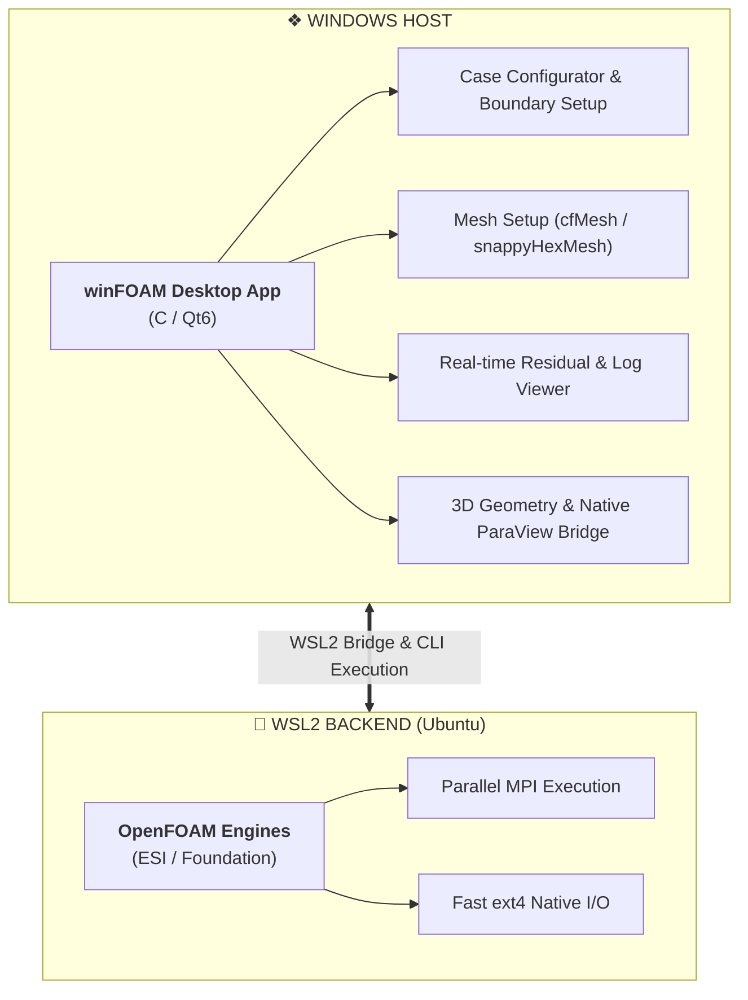

<div align="center">

# winFOAM

### *Modern, Native Windows GUI for OpenFOAM via WSL2*

[](LICENSE)
[](https://microsoft.com/windows)
[](https://ubuntu.com)
[](#-roadmap)

<br/>

<p align="center">
  A responsive Windows interface engineered to streamline CFD case configuration, meshing, solver execution, and post-processing without leaving the Windows desktop.
</p>

[Architecture](#-architecture) •
[Features](#-planned-features) •
[Prerequisites](#-prerequisites) •
[Quick Setup](#-quick-setup) 

</div>

---

## ⚡ Why winFOAM?

Running OpenFOAM directly on Windows historically required cumbersome virtual machines or unmaintained native builds. **winFOAM** offers a high-performance alternative:

* **Native Desktop Experience**: Intuitive GUI built with Python and Qt running directly on Windows.
* **Full Linux Compute Efficiency**: OpenFOAM solvers and meshing tools run natively inside WSL2 with optimal CPU, RAM, and MPI scalability.
* **Zero I/O Bottlenecks**: Case directories are managed on WSL2 native ext4 storage (`\\wsl$\...`), completely bypassing the performance degradation of cross-drive mounting (`/mnt/c/`).

---

## 🏗 Architecture



---

## 🚀 Planned Features

* 🎛 **Case Setup Assistant** — Configure boundary conditions, initial fields (`0/`), turbulence models, and numerical schemes (`fvSchemes`, `fvSolution`).
* 🕸 **Integrated Meshing** — Full visual setup for both **cfMesh** and **snappyHexMesh** pipelines.
* 👁 **Geometry Inspection** — Fast 3D viewer for surface files (`.stl`, `.obj`).
* ⚡ **WSL2 Process Manager** — Single-click background solving, multi-core decomposition (`decomposePar`), and real-time residual plotting.
* 📊 **ParaView Integration** — Automatic `.foam` case generation and one-click launch with Windows-native ParaView.

---

## 📦 Prerequisites

| Environment | Component | Requirement / Recommendation |
| :--- | :--- | :--- |
| **Windows Host** | Operating System | Windows 10 (Build 19041+) or Windows 11 (64-bit) |
| | Runtime | Python 3.10 or newer |
| | Virtualization | WSL2 enabled |
| | Post-Processing | [ParaView for Windows](https://www.paraview.org/download/) |
| **WSL2 Backend** | Linux Distribution | Ubuntu 22.04 LTS (or newer) |
| | CFD Solver | OpenFOAM (ESI-OpenCFD or OpenFOAM Foundation) |
| | Meshing Packages | `snappyHexMesh`, `cfMesh`, `Gmsh`, and additional meshing tools|

---

## 🛠 Quick Setup

1. **Clone the repository**
   ```powershell
   git clone [https://github.com/dentydinh/winFOAM.git](https://github.com/dentydinh/winFOAM.git)
   cd winFOAM
   ```

2. **Configure Python virtual environment**
   ```powershell
   python -m venv .venv
   .venv\Scripts\activate
   pip install -r requirements.txt
   ```

3. **Verify WSL status**
   ```powershell
   wsl --status
   ```

---

## 📄 License

Distributed under the **MIT License**. See [`LICENSE`](LICENSE) for complete terms.

---

## 🙏 Acknowledgements

* Inspired by the open-source CFD community and my colleague.
* Special thanks to the OpenFOAM Foundation and OpenCFD Ltd. for maintaining the OpenFOAM solver ecosystem.
````
